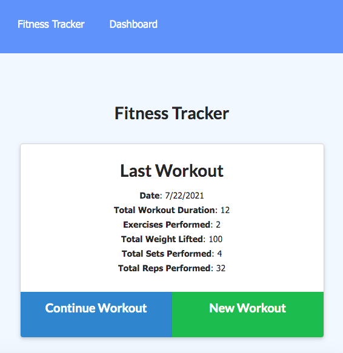

## Workout Tracker

## License
   GitHub License 
   
## Description
 This app is using Mongo to create Mongo database with a Mongoose schema and handle routes with Express. Thus, the user will able to view create and track daily workouts. Moreover, he/she should also be able to track the name, type, weight, sets, reps, and duration of exercise. If the exercise is a cardio exercise, they should be able to track my distance traveled.  
   
   ## Table of Contents

   * [Installation](#installation)

   * [Usage](#usage)

   * [License](#license)

   * [Contribution](#contributing)

   * [Testing](#testing)

   * [Questions](#questions)

## Installation
  run`npm i` in order to install this app.

## Usage
 Run the following commands in order to use it `npm start` or `node server.js`

## License
This project is licensed under the MIT license.
 
 

## Contributing
 N/A

## Testing
 N/A

## Questions
Please shoot me an email for more info
cabdale989@gmail.com
![]https://github.com/Abdale88

## Demo

  https://workout-tracker-db.herokuapp.com/
## Screen shots

